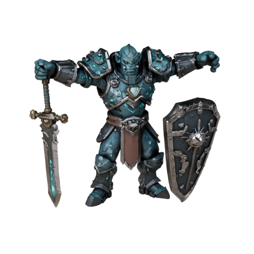
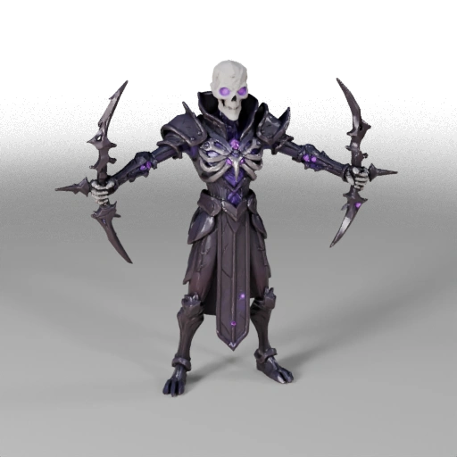
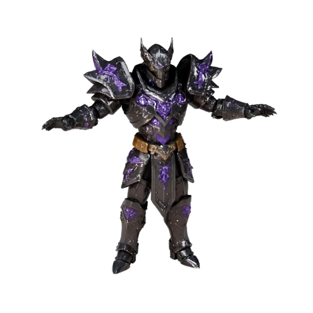
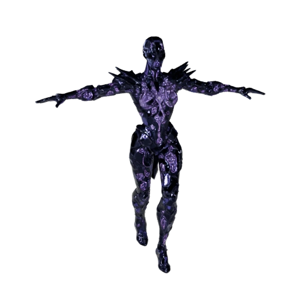
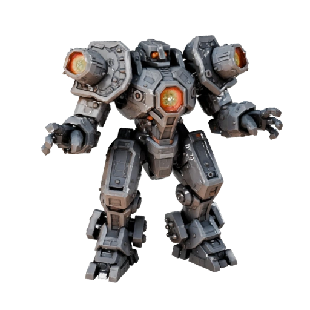

<p align="center">
  
</p>

# Crossworlds BCE

**Genre:** 4-10 player co-op combat MMO  
**Engine:** Unity 6 LTS · Universal Render Pipeline  
**Networking:** Mirror (KCP transport, port 7777) · Server-authoritative  
**Backend:** Node.js / Express 5 · MySQL · VPS auth server

---

## Quick Links

| | |
|--|--|
| Full Developer Reference | [`DEVDOC.md`](DEVDOC.md) |
| GM Commands | [DEVDOC → Section 4](DEVDOC.md#4-gm-console) |
| Controls | [DEVDOC → Section 3](DEVDOC.md#3-controls-reference) |
| Architecture | [DEVDOC → Section 7](DEVDOC.md#7-technical-architecture) |
| VPS & Server | [DEVDOC → Section 8](DEVDOC.md#8-vps--server-infrastructure) |
| Website / Download | https://playcrossworlds.com |
| Server Manager | http://playcrossworlds.com:4000 |
| GM Dashboard | http://playcrossworlds.com:4000/gm-dashboard |

---

## Classes

| Class | Role | Identity |
|-------|------|----------|
| **Warden** | Tank / Nature CC | Runic Snare, Battle Hymn, summon spirits — controls space and outlasts the fight |
| **Ironclad** | Tank / CC | Shieldwall Charge, Iron Rampart, Counter Blow — the anvil the team fights around |
| **Shadowblade** | DoT / Assassin | Shadow Veil, Dark Mark, Dark Harvest — stealth pressure and burst detonation |
| **Cleric** | Support / Heal | Soul Bond, Divine Spark, Temporal Grace — keeps the team alive under fire |
| **Arcanist** | Burst / Control | Arcane Step, Void Maw, Collapsing Void — spatial repositioning and burst payoff |

Each class has 4 equipped abilities + 1 ultimate. See [`COMBAT.md`](COMBAT.md) for full ability tables, combos, and design intent.

---

## Spellbook — All 32 Abilities

Every class draws from the **shared pool (0–7)** plus its own kit. Equip any four abilities into slots **1–4** via the Spellbook (**Tab**). Indices are fixed and mirrored server-side — never renumber.

**Shape** describes how an ability is delivered:

| Shape | Meaning |
|-------|---------|
| **Skill Shot** | Travels in a straight line — must be aimed and led onto moving targets |
| **Line** | Sweeps everything along a straight path in front of you |
| **Cone** | Bursts in a wedge in your facing direction |
| **AoE** | Placed circle at a target point on the ground |
| **Deploy** | Leaves a persistent object — turret, trap, wall, ward, or wisps |
| **Blink** | Instantly relocates you, ignoring terrain and colliders |
| **Self / Target / Team** | Affects you, a single ally/enemy, or the whole party |

Damage values are single-hit unless noted; ranges like `15–45` are uncharged → fully charged.

### Shared Pool (indices 0–7 — available to all classes)

| | # | Ability | Type | Shape | Damage | CD | Description |
|---|---|---------|------|-------|--------|----|-------------|
|  | 0 | **Runic Sentinel** | Support | Deploy | — | 6s | Deploys a stationary runic turret that fires void bolts at nearby enemies until destroyed. |
|  | 1 | **Void Bolt** | Damage | Skill Shot | 15–45 | 3s | Fires a skill-shot bolt of void energy. Charge up to triple damage — you must aim and dodge to use it well. |
|  | 2 | **Mending Circle** | Heal | AoE | — | 5s | Inscribes a glowing rune circle on the ground that heals all allies standing inside it. |
|  | 3 | **Storm Lash** | Damage | Line | 15–50 | 4s | Unleashes a rushing wall of storm energy in a line, damaging all enemies it passes through. |
|  | 4 | **Ember Surge** | Damage | AoE | 20–45 | 4s | Detonates a burst of fire at the target point, scorching all enemies caught in the blast. |
|  | 5 | **Mind Spike** | Damage | AoE | 35 | 5s | Sends a focused psychic spike to the target point, dealing heavy single-target damage. |
|  | 6 | **Binding Wave** | Damage | AoE | 15 | 6s | Releases a wide void pulse that damages and Binds all enemies in range, rooting them in place. |
|  | 7 | **Arcane Ward** | Support | Self | 50 absorb | 8s | Instantly wraps you in an arcane barrier absorbing up to 50 damage. Expires after 5 seconds. |

### Warden (indices 8–12)

| | # | Ability | Type | Shape | Damage | CD | Description |
|---|---|---------|------|-------|--------|----|-------------|
|  | 8 | **Runic Snare** | Damage | Deploy | 40 | 5s | Places an armed rune trap at the target point. Detonates in a burst when an enemy walks over it. |
|  | 9 | **Battle Hymn** | Support | AoE | — | 12s | Channels a rallying war hymn that reduces ability cooldowns for all nearby allies. |
|  | 10 | **Spirit Redirect** | Support | Target | — | 8s | Commands your active Runic Sentinel to abandon its post and focus fire on your target. |
|  | 11 | **Mend** | Heal | Target | — | 6s | Channels restorative energy into a single ally, healing wounds and purging all active debuffs. |
|  | 12 | **Conjurer's Surge** | Support | Self | — | 45s | Surges all your active deployed constructs simultaneously, triggering them at full power at once. |

### Ironclad (indices 13–18)

| | # | Ability | Type | Shape | Damage | CD | Description |
|---|---|---------|------|-------|--------|----|-------------|
|  | 13 | **Counter Blow** | Support/Damage | Cone | up to 60 | 10s | Enters an absorption stance for 3 seconds. Releasing unleashes all absorbed damage as a cone burst. |
|  | 14 | **Gravity Slam** | Support | AoE | — | 7s | Slams the ground with gravitational force, pulling all nearby enemies into the impact point. |
|  | 15 | **Shieldwall Charge** | Damage | Line | 25 | 6s | Charges forward, slamming through enemies for 25 damage and generating Threat stacks on each hit. |
|  | 16 | **Stalwart Stance** | Support | Self | — | 14s | Plants your feet: 40% damage reduction and tripled Threat generation for 6 seconds. Cannot move. |
|  | 17 | **Rune Chain** | Support | Target | — | 9s | Etches a runic leash onto one enemy for 5 seconds, absorbing 15% of attacks they land on allies. |
|  | 18 | **Iron Rampart** | Support | Deploy | — | 50s | Raises a massive stone rune wall in front of you that blocks all projectiles for 10 seconds. |

### Arcanist (indices 19–22)

| | # | Ability | Type | Shape | Damage | CD | Description |
|---|---|---------|------|-------|--------|----|-------------|
|  | 19 | **Arcane Step** | Support | Blink | — | 4s | Phase-shifts your body to the targeted location, bypassing terrain and enemy colliders. |
|  | 20 | **Void Maw** | Damage | AoE | 20 | 9s | Opens a singularity that pulls all enemies inward for 3 seconds, then detonates in a burst of void energy. |
|  | 21 | **Forked Lightning** | Damage | AoE | 30 chain | 7s | Unleashes chain lightning that arcs between up to 4 enemies (30 / 25 / 20 / 15 damage per jump). |
|  | 22 | **Collapsing Void** | Damage | AoE | 60 | 50s | Summons a massive event horizon. Pulls for 3 seconds, then collapses for 60 AoE and applies Weakened. |

### Cleric — Brandolf (indices 23–28)

| | # | Ability | Type | Shape | Damage | CD | Description |
|---|---|---------|------|-------|--------|----|-------------|
|  | 23 | **Soul Bond** | Support | Target | — | 9s | Bonds with a nearby ally for 5 seconds, rerouting all incoming damage dealt to them onto you instead. |
|  | 24 | **Spirit Wisps** | Heal | Deploy | — | 7s | Releases drifting wisps that seek out nearby allies to heal them and chip enemies they pass through. |
|  | 25 | **Divine Spark** | Heal/Damage | Target | 60 (undead) | 14s | Revives a downed ally at 30% HP — or, if cast on undead enemies, detonates for 60 holy damage. |
|  | 26 | **Sacred Aegis** | Support | Target | — | 10s | Places a living shield on an ally that grows stronger (up to 80 absorb) as they take hits over 8 seconds. |
|  | 27 | **Dispel** | Support | Target | — | 7s | Instantly purges every active debuff from a target ally, no matter how many are stacked. |
|  | 28 | **Temporal Grace** | Heal | Team | — | 60s | Rewinds the entire team 5 seconds, restoring their HP, positions, and clearing all debuffs gained since then. |

### Shadowblade — Bo-gar (indices 29–31)

| | # | Ability | Type | Shape | Damage | CD | Description |
|---|---|---------|------|-------|--------|----|-------------|
|  | 29 | **Shadow Veil** | Support | Self | — | 10s | Vanishes into full invisibility for 4 seconds. Breaking stealth immediately with Mind Spike deals +50% bonus damage. |
|  | 30 | **Silence Ward** | Support | Deploy | — | 12s | Plants a cursed fog field that silences all enemy abilities and applies Cursed (DoT) while they remain inside. |
|  | 31 | **Dark Harvest** | Damage | AoE | 20/stack | 40s | Consumes all active debuff stacks on nearby enemies, dealing 20 damage per stack consumed. |

---

## Combat System


> *Every shot is aimed. A charged Void Bolt streaks into a pack while the AoE indicator burns on the floor — no auto-attack, no tab-target, just placement and timing.*

### Smite-Style Directional Combat

Every offensive action requires aim. There is no auto-attack or tab-targeting.

| Mechanic | Detail |
|----------|--------|
| **Skill Shots** | Void Bolt fires a traveling `PlayerProjectile` — you must lead the target. Charge for up to 3× damage. |
| **AoE Placement** | Circle and Rectangle indicators show the exact area before you release. |
| **Cone Abilities** | Directional burst (Counter Blow, Shieldwall Charge) — face the target cluster. |
| **Charge Mechanic** | Hold LMB to hold an indicator. Damage and size scale with hold time up to `maxChargeTime`. Release to cast. |
| **Dodge Roll** | Left Alt or V — 2 charges, 0.35s roll, full invulnerability during the animation. |
| **Enemy Telegraphs** | 0.45s before any enemy attack lands, a red cylinder indicator appears on the ground. Read it, dodge it. |


> *The red circle is the telegraph; the blue shimmer is dodge-roll i-frames. Read the tell, roll through it — the slam lands on empty ground.*

### Server Authority

All game-state mutations run server-only (`[Server]` attribute). Clients receive visual feedback via `[ClientRpc]`. Client-only code (VFX, HUD, tooltips) is behind `#if !UNITY_SERVER`. Players are never trusted — damage is calculated server-side, kill rewards issued atomically.

---

### State Layer — DoTs, HoTs & Transitions

> **Design status:** full design is authored in `CrossWorlds/_context/COMBAT_PROPOSAL.md`. Mechanics below are the confirmed design — implementation follows the proposal's code notes. Nothing new in code yet.

The base combat is burst-oriented (build resource → detonate → reset). The state layer adds a **persistent consequence plane** so players also track what states are active on enemies and allies simultaneously. Same 32 ability slots. No new buttons. All states are visible on `StatusEffectHUD`.


> *Two planes at once: enemies rotting under green Void Rot and orange Burning DoTs on the left, allies bathed in a violet Mending Circle HoT on the right. You manage both at the same time.*

#### DoT States (applied to enemies)

| State | Damage | Duration | Stacks | Notes |
|-------|--------|----------|--------|-------|
| **Void Rot** | 4/s | 6s | up to 3× | Each stack also raises void ability damage received by 2% (3 stacks = +6%). |
| **Burning** | 6/s | 5s | 1× | Refreshes on reapply. If target is also Weakened → **Combustion**: +50% tick damage, +2s duration. |
| **Void Leak** | 3/s | 8s | 1× | On death, spreads 1 Void Rot stack to enemies within 3u. Contagion mechanic. |
| **Hemorrhage** | 5/s | 3s | 1× | Applied by Dark Mark. Does not spread; stacks alongside Cursed. Single-target DoT setup tool. |
| **Cursed** | 8/s | 4s | stackable | Shadowblade's primary stack currency. Dark Harvest now also consumes Void Rot stacks. |

#### HoT States (applied to allies)

| State | Healing | Duration | Source | Notes |
|-------|---------|----------|--------|-------|
| **Renewal** | +10 HP/s | 5s | Mending Circle on-exit | Applied when an ally *leaves* the zone, not on entry. The afterglow follows them. |
| **Triage** | +6 HP/s | 4s | Spirit Wisps on-land | Replaces the Wisps' instant heal. Same total healing over 4s. Cleric's Triage Loop procs on each tick. |
| **Sacred Regeneration** | +8–15 HP/s | 2–6s | Sacred Aegis on break | Duration scales with absorbed damage before break: min 2s (20 absorb), max 6s (80 absorb). |

#### Transition States

Emergent states produced when two specific conditions are simultaneously true on the same target. No new cast required — they occur as a consequence of correct two-player sequencing.

| Condition A | Condition B | Transition | Effect |
|-------------|-------------|------------|--------|
| Burning (active) | Slow (active) | **Scorched** | Slow upgrades to a 1.5s root. Cleared by Mend or Dispel. |
| Void Rot ×3 | Binding Wave hit | **Void Collapse** | 15 instant damage + radiates 1 Void Rot stack to all enemies within 3u. |
| Cursed ×4+ | Dark Harvest | **Withered** | After detonation: −40% move speed for 4s. (3 stacks = max damage; 4+ stacks = Withered CC — Shadowblade's decision.) |
| Weakened + Burning | — | **Combustion** | Burning already gets +50% tick and +2s from Weakened presence. Named for visual clarity. |
| Renewal + Sacred Aegis (same ally) | — | **Sanctified** | Incoming damage drains the HoT first before the shield absorbs. Extends effective shield duration. Cleric-exclusive. |
| Void Leak + Silence Ward (enemy inside zone) | — | **Void Silence** | Cursed tick damage inside the Ward is doubled for Void Leak enemies. Zone becomes high-damage if pre-seeded. |
| Shieldwall Charge (passing Void Rot enemy) | — | **Contamination Pass** | Ironclad spreads 1 Void Rot stack to every enemy passed through during the charge. AoE DoT seeding as a side effect. |

---

### Per-Class State Mechanics

#### Warden — Construct Tactician
- **Runic Snare detonation** → enemy gains **Structural Weakness** (6s): +15% damage taken from constructs. Snare becomes a mark, not just a trap.
- **Overengineered at max stacks** → active Sentinels emit a void pulse every 4s applying 1 Void Rot stack (3u radius). Constructs become passive DoT applicators.
- **Sentinel amplification** → Sentinel shots deal bonus void damage equal to (Void Rot stacks on target × 3). At 3 stacks, +9 void per hit — highest sustained single-target DPS window in the game when combined with Arcanist pre-stacking and Conjurer's Surge.
- **Battle Hymn interaction** → allies who cast during the 8s CDR window apply **Attuned** (1s); on expiry, each proc reduces the Warden's next construct CD by 1s. Cross-class CDR feedback loop.
- **Mend** can break the Scorched transition (Burning+Slow root) — distinct cleanse flavor from Cleric's Dispel.

#### Ironclad — Iron Vanguard
- **Counter Blow max-absorption release** → 2s of **Iron Aura**: damage dealt to nearby allies (6u) is partially redirected to Ironclad (15% per hit). A second passive Soul Bond window without Cleric involvement.
- **Stalwart Stance** → also applies **Resolve**: next CC received is reduced by 50% duration. Encourages standing ground during Stance.
- **Rune Chain Tension** → leashed enemy accumulates 1 Tension stack per 1.5s while leashed. On leash expiry or break: AoE Stagger on the target and nearby (2u). Free CC from a setup ability.
- **Iron Rampart Exposed** → enemies that impact the wall (blocked projectiles or enemies driven into it) gain **Exposed** (5s): +15% physical damage taken. Drive enemies into the wall via Gravity Slam for the team's follow-up.
- **Contamination Pass** → Shieldwall Charge through a Void Rot enemy spreads 1 stack to the entire charge path. Accidental AoE DoT seeding.

#### Arcanist — Void Mage
- **Void Bolt hit** → always applies 1 Void Rot stack (charged or not; charge gives burst damage, not extra stacks). 3 Void Bolt hits = fully stacked target ready for Void Collapse, Sentinel amplification, or Dark Harvest consumption.
- **Ember Surge split** → uncharged applies Burning (DoT setup); charged = existing burst damage. The key decision: charge for damage, or tap for Combustion setup.
- **Arcane Step echo** → the existing 1s-delay detonation also applies Void Leak to all enemies in the radius. Void Leak seeded passively on every blink through a group.
- **Forked Lightning DoT propagation** → if the first chain target has Void Rot ×3, the chain spreads 1 Void Rot stack to each subsequent target (up to 4 enemies). One cast seeds an entire cluster.
- **Phase Charge exclusive proc** → if the 6th cast (Phase Charge empowered hit) applies Burning, Combustion triggers immediately without Weakened being present. One-time proc that rewards saving Phase Charge for Ember Surge.
- **Arcane Ward on break** → releases a void pulse applying 1 Void Rot stack to enemies within 4u. Self-defense becomes stack application.

#### Cleric — Soul Warden
- **Mending Circle Renewal** → allies who *leave* the zone carry Renewal (+10 HP/s, 5s). Zone's reach now extends beyond its radius.
- **Spirit Wisps become Triage** → Wisps apply Triage (+6 HP/s, 4s) on landing instead of instant heal. Same total healing over duration. Cleric tracks active Triage timers and decides when to re-cast.
- **Sacred Aegis → Sacred Regeneration on break** → conversion on full absorb. Min 2s at 20 absorb; max 6s at 80 absorb. Rewards proactive shielding before damage arrives.
- **Sanctified** → Renewal + Sacred Aegis both active on same ally = incoming damage drains the HoT first before shield absorbs. Purely emergent.
- **Triage Loop passive refinement** → 5% instant + 3% as a 4s personal Triage HoT on the Cleric herself. Refreshes with every heal applied. Always self-sustaining during active healing.
- **Dispel change** → targets the *most dangerous* single debuff (highest damage/duration), not all debuffs. Mend (surgical, removes 1) vs Dispel (targeted nuclear against transition states like Scorched or Void Silence).

#### Shadowblade — Void Infiltrator
- **Dark Mark gains Hemorrhage** → Dark Mark now applies Hemorrhage (+5 dmg/s, 3s) alongside its existing Weakened + Cursed. Single-target DoT setup tool on priority enemies.
- **Shadow Veil exit** → exit already applies Cursed via Corruption; now also applies 1 Void Rot stack to all nearby enemies. Dual-DoT burst on stealth exit.
- **Bounty System kill radiation** → on kill, Corruption passive gives −2s CDR (unchanged) + now also applies 1 Cursed stack to the nearest 2 enemies (within 8u). Every kill seeds the next target in wave content.
- **Withered at 4+ stacks** → Dark Harvest at 4+ Cursed stacks = Withered (−40% move speed, 4s). 3 stacks = max damage; 4+ stacks = Withered CC. Against bosses at phase transitions, Withered is almost always worth more.
- **Shattered on Weakened Harvest** → if the target is Weakened when Dark Harvest fires, survivors gain **Shattered** (3s): next attack from any player deals +25% damage. Team-wide finish window.

---

### Cross-Class Synergies (State Layer)


> *Alone, each hero is strong. Together, the seams between their kits become weapons: the Arcanist seeds decay the Shadowblade harvests, the Ironclad bunches the pack the Warden's turrets shred, and the Cleric makes every reckless play survivable. The best plays live in these overlaps.*

| Combo | Mechanic |
|-------|----------|
| **Arcanist → Shadowblade** | Void Bolt builds Void Rot. Dark Harvest now consumes Void Rot stacks. 3 pre-built Void Rot stacks = 3 free Harvest stacks. |
| **Ironclad → Arcanist** | Rune Chain holds a target 5s — clean window for 3 Void Bolts → Void Rot ×3 → Binding Wave → Void Collapse (15 AoE + contamination). |
| **Warden + Arcanist** | Arcanist pre-builds Void Rot ×3 on a target; Warden Spirit Redirects all Sentinels to that target (+9 void per hit). Conjurer's Surge during this window = highest single-target DPS in the game. |
| **Cleric + Any** | Mending Circle Renewal changes arena movement — the team routes *through* the zone edge to pick up Renewal, not stand in the center. |
| **Arcanist + Shadowblade** | Arcane Step echo applies Void Leak to a group; Shadowblade drops Silence Ward on the same group → **Void Silence**: doubled Cursed ticks inside the ward. Highest sustained AoE damage window. |
| **Ironclad + Warden** | Iron Rampart blocks a corridor; Gravity Slam pulls enemies into the wall → Exposed (+15% physical taken); Warden's AoE lands on a clump at full density. |
| **Shadowblade + Ironclad** | Kill radiation (Bounty System) applies 1 free Cursed stack to the Rune Chain target. Reduces Shadowblade cast count needed to reach Dark Harvest threshold. |
| **Cleric + Ironclad** | Sacred Aegis on Ironclad while he Counter Blow absorbs; Aegis breaks → Sacred Regeneration activates; Counter Blow releases simultaneously. If Renewal also active → **Sanctified**: layered recovery post-burst. |
| **⚠ Negative** | Mending Circle must NOT cleanse enemy debuffs — a poorly placed zone could erase Shadowblade's Corruption/Void Rot stacks. Design rule: Mending Circle cleanse is ally-only. |

---

### Boss Mechanic Hooks (Design — Phase 3)

Each boss reads at least one active state from the party and reacts to it.

#### Null Architect
- **Phase 2 — Tether Web:** leashed players gain 1 Void Rot stack every 2s while tethered. At Void Rot ×3 while leashed: tether briefly stuns (1s). Mend or Dispel clears Void Rot from the leashed player — Cleric has a clear urgent job.
- **Final Surge — Resonance Penalty:** for every active DoT on the Null Architect when Final Surge begins, it gains +5% attack speed (max +15% with 3 DoTs active). Forces a pre-Surge DoT cleanse window where the team *stops* applying damage. Real tension.

#### Iron Warden (Phase 3)
- **Magnetized Pulse:** each active turret arm emits a pulse every 12s applying Magnetized (8 dmg/s, 3s) to all players. Not cleansed by Dispel. Cleared by standing in Mending Circle for 1.5s. Cleric's zone placement becomes infrastructure.
- **Arm Respawn Burning Immunity:** respawned arms are immune to Burning for 6s. Void Rot pre-stacks before destruction carry over. Spirit Redirect during the immunity window is the intended counter.
- **Core Threat Targeting:** Core targets the player with the lowest Threat stacks. Ironclad in Stalwart Stance locks Core onto himself; while targeted, Counter Blow absorb applies a team-wide 15% redirect.

#### Void Herald (Phase 3)
- **Void Mark Escalation:** stealth phase applies Void Mark to all players (3 Cursed stacks, boss-applied, not Harvest-consumable). +1 stack per 2s. Silence Ward placed inside reveals the Herald for 2s. Dispel clears 3 stacks from one ally per cast.
- **Dark Harvest Mirror:** at 8+ Void Mark stacks when stealth ends → 160 instant damage (20 × 8). Temporal Grace is the primary counter — but rolling back also un-Dispels any cleanse casts made in the last 5s.
- **Void Leak Trap:** if the Herald has Void Leak active when stealth ends, the reveal detonation spreads 1 Cursed stack to nearby players. Arcanist must track their own Arcane Step echo to not seed Void Leak on the Herald during setup.

---

## AFK Professions


> *Between runs, the real work: ore into ingots, ingots into gear, the anvil ringing under the rose window. Some of the strongest tools in the game are never dropped — only forged.*

Press **F** once at a gathering station, then go make a coffee. The game rewards you while you're idle.

Every `tickInterval` seconds the station awards one item directly to your inventory (via `/api/inventory/add-item`) and posts profession XP to the server (via `POST /api/professions/award-xp`). Moving more than 4 units away, pressing **F** again, or pressing **Escape** cancels the session. Level gates prevent high-tier nodes until you've earned them.

---

### Professions

<table>
<tr>
<td align="center"><br/><b>Mining</b><br/>ID 2</td>
<td align="center"><br/><b>Woodcutting</b><br/>ID 0</td>
<td align="center"><br/><b>Fishing</b><br/>ID 1</td>
</tr>
</table>

XP formula (matches web panel): **xpToNextLevel = currentLevel × 50**
(Level 1→2: 50 xp · Level 5→6: 250 xp · Level 10→11: 500 xp)

---

### Resource Tiers

<table>
<tr>
  <th>Profession</th>
  <th>Tier</th>
  <th>Station</th>
  <th>Item</th>
  <th>Level Req</th>
  <th>Tick</th>
  <th>XP/tick</th>
  <th>Bonus ×2 at</th>
</tr>
<tr>
  <td rowspan="3"><b>Mining</b></td>
  <td>1</td>
  <td>Copper Vein</td>
  <td> ore_copper</td>
  <td>1</td>
  <td>5s</td>
  <td>10</td>
  <td>Lv 10</td>
</tr>
<tr>
  <td>2</td>
  <td>Iron Vein</td>
  <td> ore_iron</td>
  <td>5</td>
  <td>6s</td>
  <td>20</td>
  <td>Lv 15</td>
</tr>
<tr>
  <td>3</td>
  <td>Gold Vein</td>
  <td> ore_gold</td>
  <td>15</td>
  <td>8s</td>
  <td>40</td>
  <td>Lv 25</td>
</tr>
<tr>
  <td rowspan="1"><b>Woodcutting</b></td>
  <td>1</td>
  <td>Oak Tree</td>
  <td> log_oak</td>
  <td>1</td>
  <td>6s</td>
  <td>10</td>
  <td>Lv 10</td>
</tr>
<tr>
  <td rowspan="1"><b>Fishing</b></td>
  <td>1</td>
  <td>Fishing Spot</td>
  <td> fish_river</td>
  <td>1</td>
  <td>8s</td>
  <td>8</td>
  <td>Lv 10</td>
</tr>
</table>

---

### Gathering HUD

While AFK gathering a minimal HUD appears at the bottom of the screen:

```
LoginScene → CharacterSelect → GameWorld
```
- `LoginManager` — full MMO login UI built in code; username/password auth, register panel, server IP field (saves to PlayerPrefs), animated title, dev HOST button
- `CharacterSelectManager` — 3D character preview via RenderTexture on layer 31; class list, ability readout, ENTER WORLD; reads server IP from PlayerPrefs before StartClient()
- `RodPositionSaver` — attached at runtime to server-side player objects; PATCH /character/position on disconnect or app quit via temporary coroutine host

### Combat

All combat scripts live in `Assets/Game/Combat/Scripts/`.

**Core systems**

| Script | Type | Purpose |
|---|---|---|
| `Health.cs` | MonoBehaviour | Server-authoritative HP — `maxHealth`, `currentHealth`, `IsAlive`, `Fraction`, `IsDowned`. Events: `onDeath`, `onDamageTaken(float)`, `onHealthChanged(float,float)`, `onKilledBy(GameObject)`, `onHealApplied(float)`, `onDownedChanged(bool)` |
| `StatusEffect.cs` | Plain C# | Single effect instance — type, duration, magnitude, source |
| `StatusEffectManager.cs` | MonoBehaviour | Applies / ticks / expires effects. Queries: `IsStaggered`, `IsBound`, `IsSilenced`, `GetSlowFraction()`. Types: Slow, Stagger, Silenced, Cursed, Weakened, Bound |
| `DropTable.cs` | ScriptableObject | `RollDrops()` → `(List<(itemId, qty)> items, int gold)`. Configurable weights, gold range, nothing-weight. Create via BCE/DropTable asset menu |
| `WorldItem.cs` | NetworkBehaviour | Floor loot — floats + rotates, collected on player trigger, server-despawns after 90s |

**Enemy AI**

`EnemyController.cs` — server-authoritative state machine:
```
Idle ──(player enters aggroRadius)──► Chase ──(in attackRange)──► Attack
  ▲                                      │
  └── leash: returns to spawn if too far ┘
Dead ◄── Health.onDeath
```

---

### Backend — `POST /api/professions/award-xp`

New VPS endpoint. Code in [`_CONTEXT/professions-award-xp-patch.js`](_CONTEXT/professions-award-xp-patch.js) — insert near `GET /api/professions/:characterId` in `server.js`.

```
POST /api/professions/award-xp   (requireJWT)
Body: { characterId, professionId, xpAmount }
Returns: { success, data: { skill_level, skill_xp, leveled_up, profession_id } }
```

- Upserts the `professions` row (safe for first-time use)
- XP is capped 1–500 per call (anti-exploit)
- Level-up loop handles multi-level gains at low XP totals
- Level-up logged server-side: `[PROF] char 1 — Mining leveled up to 5`

**Apply to VPS:**
```bash
# On VPS: insert the patch block into server.js, then restart
sudo nano /opt/crossworlds-auth/server.js   # paste near GET /api/professions route
sudo systemctl restart crossworlds-auth
curl -s http://localhost:3000/api/professions/1   # verify endpoint responds
```

---

### Implementation Files

| File | Purpose |
|------|---------|
| [`Assets/Game/Systems/AfkGatheringStation.cs`](Assets/Game/Systems/AfkGatheringStation.cs) | AFK loop — F to start, auto-award per tick, drift cancel |
| [`Assets/Game/Systems/ProfessionManager.cs`](Assets/Game/Systems/ProfessionManager.cs) | Client singleton — loads/caches profession levels, posts XP, fires level-up event |
| [`Assets/Game/UI/GatheringHUD.cs`](Assets/Game/UI/GatheringHUD.cs) | Screen-space HUD — progress bar, pulse on yield, level-up flash |
| [`Assets/Game/Editor/AfkStationBuilder.cs`](Assets/Game/Editor/AfkStationBuilder.cs) | BCE menu: 8a–8f drop stations into Hub scene |
| [`_CONTEXT/professions-award-xp-patch.js`](_CONTEXT/professions-award-xp-patch.js) | VPS patch — `POST /api/professions/award-xp` |
| `Assets/Game/Combat/Scripts/ResourceNode.cs` | Legacy manual F-key harvest (still valid for one-shot depleting nodes) |

**Editor steps to wire it up:**
1. Open Unity → Hub scene
2. `BCE/Setup/8f` — adds `ProfessionManager` to scene
3. `BCE/Setup/8a` through `8e` — drops each station mesh into the scene; position as desired
4. Call `ProfessionManager.Local.Load()` from your hub `OnStartClient` (or `LoginManager` post-login callback)
5. Apply VPS patch → `sudo systemctl restart crossworlds-auth`

---

## Encounters & NPCs


> *The portal spits you onto cracked rune-stone, and the fog is already moving. No countdown, no safe first step — the arena starts the instant your boots land.*

### NPCs — Hub World


> *Between runs, the arena falls silent and the city breathes again. Forge-fire and lantern-light push back the fog; adventurers trade rumours over the anvil while the portal turns, patient, at the far wall.*

Two persistent NPCs live in the Hub world and drive the crafting and trading loop.

| NPC | Script | Role |
|-----|--------|------|
| **Forge Master** | `ForgeNPC.cs` | Crafting station — material → gear recipes, interacts via `INPCInteractable` |
| **The Hangman** | `HangmanNPC.cs` | Travelling merchant — rare item trades, triggers dialogue UI before arena entry |

<table>
<tr>
<td align="center"><br/><b>Forge Master</b></td>
<td align="center"><br/><b>The Hangman</b></td>
</tr>
</table>

**NPC architecture:**  
- All hub NPCs implement `INPCInteractable` — proximity-trigger interaction, handled by `NPCInteractionManager`
- `NpcController.cs` drives idle breathing + slow patrol within `patrolRadius`
- Animated via `Animator` Speed parameter (0 = idle, 1 = walk)
- No Health/Mirror dependency — hub NPCs are purely cosmetic/interactive

---

### Enemy Roster


> *The Void does not tire, and it never comes alone. Grunts crash in first, archers crackle behind them, and somewhere in the fog a Knight is already moving. Watch the red circles — everything that kills you announces itself first.*

Three enemy variants spawn in arenas. All are server-authoritative via `EnemyController.cs`.

<table>
<tr>
<td align="center">
  <br/>
  <sub><i>3D model render</i></sub><br/>
  <br/>
  <b>Void Grunt</b><br/>
  <a href="Docs/models/enemy-grunt/enemy-grunt.glb">⬇ GLB</a>
</td>
<td align="center">
  <br/>
  <sub><i>3D model render</i></sub><br/>
  <br/>
  <b>Void Archer</b><br/>
  <a href="Docs/models/enemy-ranged/enemy-ranged.glb">⬇ GLB</a>
</td>
<td align="center">
  <br/>
  <sub><i>3D model render</i></sub><br/>
  <br/>
  <b>Void Knight (Elite)</b><br/>
  <a href="Docs/models/enemy-elite/enemy-elite.glb">⬇ GLB</a>
</td>
</tr>
</table>

| Type | Prefab | Role | Aggro | Attack | Damage | XP |
|------|--------|------|-------|--------|--------|----|
| **Void Grunt** | `Enemy_Grunt` | Melee frontline | 8u | 1.5s | 12 | 20 |
| **Void Archer** | `Enemy_Ranged` | Ranged kite | 8u | 2s | 10 | 20 |
| **Void Knight** | `Enemy_Elite` | Elite tank | 10u | 2s | 20 | 50 |

**Enemy AI state machine** (`EnemyController.cs`):

```
Idle → (player enters aggroRadius) → Chase → (in attackRange) → Attack
              ↑ leashRadius exceeded ←──────────────────────────────────┘
```

- **0.45s attack telegraph** — red cylinder AoE preview before damage lands (dodge it)
- Ranged enemies backpedal if the player closes inside `tooCloseDistance = 3u`
- Respects all status effects: Stagger (interrupt), Bound (immobile), Silenced (can't attack), Slow (speed multiplied)
- Death: VFX burst → loot rolls → `POST /api/combat/kill` for server-authoritative XP → `NetworkServer.Destroy`

**Wave composition** (`WaveSpawner.cs`):
- 67% Grunts / 33% Archers per wave
- +2 enemies per wave (Wave 1 = 4, Wave 5 = 12, Wave 10 = 22)
- Elite spawns every 3rd wave; wave waits for all enemies dead before advancing
- Max 10 waves → arena clear bonus (+200 mastery XP)

---

### Cursed Chest Encounter


The **Wave Chest** (`WaveChest.cs`) is a special encounter placed in arena rooms. Hold-to-open (2s) → spawns a custom enemy roster → loot on completion.

- Scales enemy count to nearby player count
- Prep window lets players position Warden turrets before first wave
- Drops configured loot on all-clear

---

### Boss Encounter — The Null Architect


<table>
<tr>
<td align="center" width="50%">
  <br/>
  <sub><i>3D model — Tripo PBR render</i></sub><br/>
  <a href="Docs/models/null-architect/null-architect.glb">⬇ Download GLB</a>
</td>
<td align="center" width="50%">
  <br/>
  <br/>
  <br/>
  <sub><i>Phase 1 · Phase 2 · Phase 3</i></sub>
</td>
</tr>
</table>

> *"The Null Architect did not build the void — it was built by it."*

The Null Architect is Crossworlds BCE's world boss. It is a fully scripted 3-phase encounter implemented in `WorldBossController.cs`. The fight is server-authoritative: all ability timing, phase transitions, and damage are computed on the dedicated server and broadcast to clients via Mirror RPCs.

**Entry:** A `BossTrigger` child collider (radius 15u) starts the fight the moment the first player steps inside. Once started, the encounter cannot be reset until the boss dies or the server restarts.

---

#### Phase 1 — The Mirror (100% → 60% HP)


The Null Architect fights at full strength. Every 18 seconds it enters a **Reflect window**.

| Timing | Event |
|--------|-------|
| T−3s | Chat warning: *"REFLECT in 3s — stop attacking!"*; telegraph VFX pulses |
| T=0 | `isReflecting = true` — **stop all DPS** |
| T+4s | Reflect window closes — resume attack |

**Mechanic:** Any damage dealt to the boss during the 4-second window is reflected as an AoE pulse hitting all players within 10u for **75% of that damage**. A single Collapsing Void (60 dmg) during reflect hits every teammate for 45 damage.

**Counter:** Watch chat + VFX. Cease fire on the warning. Repositioning and dodge-rolling are safe.

**Phase transition at 60% HP:**
- 4-second immunity window (`isImmune = true`)
- Chat: *"PHASE SHIFT — Null Architect fragments into shards!"*
- All Phase 1 coroutines stopped cleanly

---

#### Phase 2 — Shard Fracture (60% → 30% HP)


Three **Null Shards** spawn at 6u spacing from the boss. Each has 400 HP and must be destroyed **simultaneously** — surviving shards cross-heal for 50% of damage dealt to their sibling.

| Shard Count | Cross-heal per hit |
|-------------|-------------------|
| 3 alive | Others heal 50% of damage received |
| 2 alive | Survivor heals 50% of damage to dead sibling |
| 1 alive | Safe to kill freely |

Every 25 seconds the boss casts **Tether Web**:
- Randomly pairs all players
- Each pair must stay within **6u** of each other for 6 seconds
- Snapping the tether deals **40 damage to both** tethered players

**Strategy:** Coordinate DPS on shards (burst simultaneously), stack with your tether partner, then swap focus to the boss.

**Phase transition at 30% HP:**
- 4-second immunity window
- Chat: *"CRITICAL — Null Architect destabilises! All damage amplified!"*
- Boss gains `Weakened` status effect → **+25% incoming damage** for the rest of the fight

---

#### Phase 3 — Null Collapse (30% → 0% HP)


No more shards. The boss is weakened (+25% dmg taken) but dangerous — Void Drain punishes spread.

Every 12 seconds: **Void Drain**

| Zone | Effect |
|------|--------|
| Within 5u of boss | Safe |
| Beyond 5u | 8 damage/second for 4 seconds |

Players must stack on the boss during Void Drain, then spread for Tether safety between casts. Void Drain and Tether Web can overlap — coordinate both.

**At 10% HP: Final Surge** (one-time)

- Chat: *"⚠⚠ FINAL SURGE — Null Architect ENRAGED! Burn it down NOW!"*
- Boss movement speed ×3, attack speed ×3
- Lasts 15 seconds — if the boss survives the surge it returns to normal
- Burn everything; cooldowns should be saved for this window

---

#### Boss Loot Table

| Item | Drop Type | Chance |
|------|-----------|--------|
| `sword_iron` | Guaranteed | 100% |
| `plate_iron` | Guaranteed | 100% |
| `ring_copper` | Rare | 35% |
| `material_copper_bar` | Rare | 35% |

#### Boss HP Bar (Client UI — `WorldBossHealthBar.cs`)

- Phase markers drawn at 60% and 30% HP thresholds
- Bar color changes by phase: **cyan** (P1) → **orange** (P2) → **red** (P3) → **white** (immune/transition)
- Driven by `SyncVar` hook `OnPhaseSync` → `WorldBossHealthBar.OnPhaseChanged(phase)`

---

#### Boss Quick Reference Card

```
The Null Architect — 2000 HP · 3 Phases · Server-Authoritative

Phase 1 (100–60%)   Reflect Pulse every 18s — stop DPS during 4s window
                    Transition: 4s immune → 3 Null Shards spawn

Phase 2 (60–30%)    3 Shards (400HP each) — burst simultaneously or cross-heal
                    Tether Web every 25s — stay within 6u of your pair
                    Transition: 4s immune → Boss gains Weakened (+25% dmg taken)

Phase 3 (30–0%)     Void Drain every 12s — stack within 5u or 8dps for 4s
                    Final Surge at 10% — speed×3, atk×3 for 15s (burn window)

Loot:               sword_iron + plate_iron (guaranteed)
                    ring_copper, material_copper_bar (35% each)
```

---

#### Implementation Files

| File | Purpose |
|------|---------|
| [`Assets/Game/Combat/Scripts/WorldBossController.cs`](Assets/Game/Combat/Scripts/WorldBossController.cs) | All phase logic, RPCs, loot |
| [`Assets/Game/Combat/Scripts/WaveSpawner.cs`](Assets/Game/Combat/Scripts/WaveSpawner.cs) | Arena wave manager |
| [`Assets/Game/Combat/Scripts/WaveManager.cs`](Assets/Game/Combat/Scripts/WaveManager.cs) | Flexible wave rosters (boss, elite, mob tiers) |
| [`Assets/Game/Combat/Scripts/EnemyController.cs`](Assets/Game/Combat/Scripts/EnemyController.cs) | Enemy AI state machine |
| [`Assets/Game/Combat/Scripts/StatusEffectManager.cs`](Assets/Game/Combat/Scripts/StatusEffectManager.cs) | Buff/debuff system |
| [`Assets/Game/Combat/Scripts/ArenaSessionController.cs`](Assets/Game/Combat/Scripts/ArenaSessionController.cs) | Session XP/kill tracking |
| [`Assets/Game/Combat/Scripts/WaveChest.cs`](Assets/Game/Combat/Scripts/WaveChest.cs) | Cursed chest encounter |
| [`Assets/Game/UI/WorldBossHealthBar.cs`](Assets/Game/UI/WorldBossHealthBar.cs) | Client phase-aware HP bar |
| [`Assets/Game/Editor/WorldBossBuilder.cs`](Assets/Game/Editor/WorldBossBuilder.cs) | One-click boss prefab builder |
| [`Assets/Game/Editor/ArenaSceneBuilder.cs`](Assets/Game/Editor/ArenaSceneBuilder.cs) | One-click arena scene builder |

---

### Boss Encounter — The Iron Warden


<table>
<tr>
<td width="340" valign="top">

<br/><sub><a href="Docs/models/iron-warden/iron-warden.glb">⬇ Download 3D model (.glb)</a></sub>
</td>
<td valign="top">

**The Iron Warden** is a siege-engine colossus — a fortress golem built to outlast anything thrown at it. Where the Null Architect punishes aggression with phase reactions, the Iron Warden punishes passivity: it layers mechanical systems that force the party to make active decisions under pressure, or get ground to dust.

The encounter is implemented in `IronWardenController.cs` following the same server-authoritative pattern as the Null Architect. Phase transitions, ability timing, turret spawns, and Magnet Pulls are all computed on the dedicated server. Clients receive `[ClientRpc]` announcements and VFX triggers; no game-state decisions run client-side.

**Entry:** A `BossArenaTrigger` collider (placed via **BCE/Setup/9b**) fires `IronWardenController.Activate()` the moment any player enters. The encounter cannot be reset once started.

</td>
</tr>
</table>

> *"The Iron Warden was forged to hold. It does not attack you. It simply makes sure you can never leave."*

---

#### Phase 1 — Siege Protocol (100–60% HP)


The Warden opens in full fortress mode. Its rotating Barrier Wall forces positional discipline while Mortar Strikes punish clustering.

| Timing | Event |
|--------|-------|
| Every 12 s | **Barrier Wall** — a ring of iron shields rotates around the boss. Players in the wrong arc receive 10 dmg/s push-back and reduced damage output. Players on the correct arc deal full damage. |
| Every 20 s | **Mortar Strike** — five red AoE circles appear in sequence across the arena, each detonating 1 second after the previous (30 dmg per blast). Spread out. |

The Barrier Wall arc indicator is a client-side VFX (`RpcSpawnBarrierWall`). Pay attention to it — damage output is halved for anyone on the wrong side.

**Phase transition at 60% HP:**
- 3-second stagger animation
- Chat: *"[BOSS] Shield Matrix online — destroy BOTH turrets simultaneously!"*
- All Phase 1 coroutines stopped cleanly

---

#### Phase 2 — Shield Matrix (60–25% HP)


The Warden opens its chest cavity and deploys two **Siege Turrets** at opposite flanks. Until both are destroyed at the same time, the boss is completely immune to damage.

| Timing | Event |
|--------|-------|
| Immediate | Two **Siege Turrets** (300 HP each) spawn at ±8u on the X axis. Fire orange bolts at nearby players (10 dmg, every 3 s). |
| If only one turret dies | The surviving turret **auto-repairs** to full HP after 10 seconds. Both must die within seconds of each other. |
| Every 20 s | **Magnet Pull** — all players are yanked toward the boss centre, then a 60-dmg AoE stomp drops in a 8u radius. |

The immunity mechanic demands coordination: split the party, burst both turrets simultaneously, then immediately pivot to the boss before the next Magnet Pull. `SiegeTurretBehaviour.cs` handles turret combat and calls `warden.OnTurretDestroyed()` — the boss tracks count and restores immunity if only one fell.

**Phase transition at 25% HP:**
- Chat: *"[BOSS] The Iron Warden's core is exposed — RAMPAGE!"*
- Boss NavMeshAgent speed multiplied by 1.5×

---

#### Phase 3 — Rampage (25–0% HP)


Armor cracked open to reveal the forge-fire core. The Warden stops playing defence and tries to physically destroy the party.

| Timing | Event |
|--------|-------|
| Every 4 s | **Ground Slam** — 35 dmg in 6u radius. 0.45s telegraph cylinder before impact. |
| At ≤15% HP | **Lockdown** — all players rooted for 5 seconds while the Warden charges a Devastation Slam (60 dmg, 10u radius). |

The Lockdown fires only once. It is telegraphed with a 1.5-second warning circle. Healers need to pre-stack healing before the root drops — you cannot move during the charge. After Devastation fires, the Warden is at its most vulnerable: this is the burn window.

> **Lockdown sequence:** `LockdownSequence()` applies `StatusEffectManager.ApplyRoot()` to all `PlayerIdentity` objects via server-side `FindObjectsByType`, waits 5 seconds, shows a 1.5s `RpcShowWarningCircle`, then calls `DealAoeDamage()` — all server-side, no client prediction.

---

#### Class Synergies (Iron Warden)

Each class has a specific role this fight pressures:

| Class | Role |
|-------|------|
| **Warden** | Runic Snare + Iron Rampart to hold turret aggro while the ranged party bursts |
| **Ironclad** | Shieldwall Charge through Barrier Wall arc — can maintain damage in wrong-arc zones briefly |
| **Cleric** | Mending Circle pre-staged for Magnet Pull landing zone; Dispel on Magnetized status |
| **Arcanist** | Void Maw + Forked Lightning for simultaneous turret burst — the key to breaking Shield Matrix |
| **Shadowblade** | Shadow Veil to dodge Mortar Strike; silence turrets during repair window |

---

#### Boss Quick Reference Card

```
The Iron Warden — 3000 HP · 3 Phases · Server-Authoritative

Phase 1 (100–60%)  Barrier Wall every 12s — position on correct arc for full damage
                   Mortar Strike every 20s — 5 staggered blasts, spread out
                   Transition: turret deploy announcement

Phase 2 (60–25%)  IMMUNE until both Siege Turrets (300 HP each) die simultaneously
                   One turret alone → surviving turret repairs after 10s
                   Magnet Pull every 20s → yank to centre + 60 AoE stomp
                   Transition: NavMesh speed ×1.5

Phase 3 (25–0%)   Ground Slam every 4s — 35 dmg, 6u radius, 0.45s telegraph
                   At 15% HP: Lockdown (root 5s) → Devastation (60 AoE, one-shot)

Kill:             ArenaSessionController.OnBossKilled() → chest + XP
```

#### Implementation Files

| File | Purpose |
|------|---------|
| [`Assets/Game/Combat/Scripts/IronWardenController.cs`](Assets/Game/Combat/Scripts/IronWardenController.cs) | Boss controller — phases, abilities, SyncVar |
| [`Assets/Game/Combat/Scripts/SiegeTurretBehaviour.cs`](Assets/Game/Combat/Scripts/SiegeTurretBehaviour.cs) | Phase 2 turret — fire loop, death, warden callback |
| [`Assets/Game/Editor/IronWardenBuilder.cs`](Assets/Game/Editor/IronWardenBuilder.cs) | One-click boss + turret + trigger builder |

> **Editor steps:** Run **BCE/Setup/9a** to place the boss, **9b** for the arena trigger, **9c** for turret placeholders. Assign `warningCirclePrefab` in the `IronWardenController` Inspector field. Bake NavMesh for the arena scene before playtesting.

---

## Features Status

| Feature | Status |
|---------|--------|
| `speed <n>` | Multiply move + sprint speed by n |
| `fly` | Toggle fly mode (gravity off, Space/Ctrl for vertical) |
| `god` | Toggle `Health.isInvulnerable` |
| `heal` | Full heal self |
| `kill` | Kill all `"Enemy"`-tagged objects |
| `spawn [n]` | Spawn n red capsule enemies near player |
| `wave [n]` | Start WaveManager or jump to wave n |
| `tp <x> <y> <z>` | Teleport player to world coords |
| `pos` | Print current world position (useful for level building) |
| `players` | List all connected players + class + position |
| `goto <name>` | Teleport to another player |
| `noclip` | Toggle player colliders off |
| `clear` / `help` | Clear log / list commands |

Access gated by `GM_USERS` allowlist in `GmConsole.cs`. Command history: ↑/↓ arrows.

### VFX
- brbmuffins Technologies particle pack (ElectricalSparks, EnergyExplosion, SmallExplosion, FireFlies, HeatDistortion)
- brbmuffins Dark Arts fantasy pack (Magic circle, Death magic circle, Lightning strike, Mana wall, Ground spikes, Fireball)
- `RodBillboard` — zone label text always faces camera
- `EnemyDeathVFX` — spawns death particles via `Health.onDeath`
- `LoginScreenVFX` — ambient atmosphere on login screen

---

## Design Pillars

- **Harder = more reward** — wave difficulty multiplier feeds loot score; higher cycles = rarer drops
- **Shared common goal** — one enemy pool, one boss HP bar; every player's damage contributes
- **Multiple paths** — Guardian tanks, Engineer builds, Medic sustains, Wraith pressures — all valid, all needed
- **Zone in and battle** — no lobby meta, no mandatory prep; pick class, enter arena, fight
- **Community crafting** — server hub (max-player zone) has trainers, shared loot pool, community-built upgrades *(planned)*
- **DoT class complete** — Wraith is fully playable with the corruption → stack → detonate loop

---

## Changelog

### 2026-06-28 — Stability & networking bug-fix pass

Audit pass across combat, networking, abilities, and status systems. All fixes are
localized and behavior-preserving for existing working paths.

- **Abilities** (`AbilityCaster.cs`) — added an `isLocalPlayer` guard so remote player
  clones no longer process local keyboard/mouse input. Previously pressing an ability key
  fired the ability on *every* player object on the client at once (and each grabbed the cursor).
- **Position save** (`RodPositionSaver.cs`) — floats now serialize with `InvariantCulture`.
  On OS locales that use a `,` decimal separator the old JSON was malformed (`"x":1,234`)
  and the `PATCH /character/position` save silently failed.
- **Spawning** (`RodNetworkManager.cs`) — `OnCreatePlayer` now rejects a duplicate
  `CreatePlayerMessage` (`conn.identity != null`), preventing orphaned player objects on the server.
- **Waves** (`WaveManager.cs`) — GM `wave <n>` (`JumpToWave`) now despawns current enemies
  instead of orphaning them alive and untracked.
- **Enemy AI** (`EnemyAI.cs`) — enemies drop dead/downed targets and ignore them when
  acquiring, instead of swinging forever at a corpse.
- **Status effects** (`StatusEffectManager.cs`) — re-applying an effect now refreshes its
  magnitude/source, so a stronger slow or curse actually takes effect.
- **Damage redirect** (`Health.cs`) — added a self-guard and re-entrancy guard to the
  Transfer Protocol redirect, eliminating an infinite loop when two targets redirect to each other.
- **Chat** (`RodChatManager.cs`) — server now logs `[CHAT] <user>: <msg>` so messages are
  visible in `crossworlds.log`.

> **Not yet addressed (architectural — tracked separately):** enemies are not
> `NetworkServer.Spawn`'d and combat damage is client-local; the GM allowlist is client-side.
> These require the server-authoritative combat build-out, not a point fix.

---

## Known TODOs / Open Bugs

| Priority | Item |
|----------|------|
| High | `GmConsole.cs` — needs `#if !UNITY_SERVER` guard (crashes server every frame) |
| Medium | Arena scene — needs NavMesh baked + WaveSpawner wired; portals in Hub are decorative (no scene transition yet) |
| Medium | Inventory bag UI — `InventoryBagUI.cs` not written; calls `GET /api/inventory/:characterId`, renders slots |
| Medium | Equip flow — slot click → `POST /api/inventory/equip` not wired |
| Medium | Portal transition — `OnTriggerEnter` in Hub portals → `NetworkManager.singleton.ServerChangeScene(arenaScene)` not wired |
| Medium | Clean up stale prefabs — `Engineer.prefab`, `Guardian.prefab`, `Wraith.prefab`, `Medic.prefab`, `PlayerPrefab.prefab` still in `Assets/Game/Prefabs/` |
| Medium | Add Arcanist to CharacterSelect scene preview |
| Low | `orientation:F3` — Unity sending float as formatted string in `PATCH /character/position` |
| Low | `CmdSendChat` — missing `[CHAT]` log line server-side |
| Low | Position save on scene exit (currently only on disconnect/quit) |

---

## Project Structure

```
Rate 